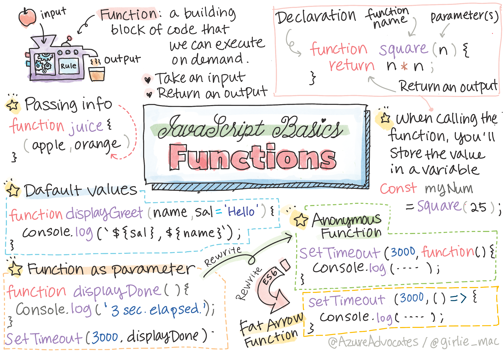

# Javascript Functions and Methods




## Main Point

| Concept | Time Estimate |
| --- | --- |
| What is function and Why do we need them | 15 mins
| Basic components of function | 10 mins
| Naming convention of function | 8 mins
| Scope of variables inside function | 8 mins
| Default parameters | 5 mins
| Arrow function |  10 mins
| Callback | 10 mins


## Function
A function is a reusable collection of lines of code that makes something happen within your program.

Three main parts constitue the function:
- Input (Parameters)
- Process (body)
- Output (return value)

```
What makes a method different from a function is that a method is attached to an object (console, in the example), and a function is free floating. You'll hear many developers use these terms interchangeably.
```

### Callback

Callbacks are frequently used in a variety of frameworks and libraries to indicate the code that you want to run when something happens or finishes. You'll use a callback to indicate what should happen when, for example, a user selects a button, a long-running operation finishes, or a timer expires.