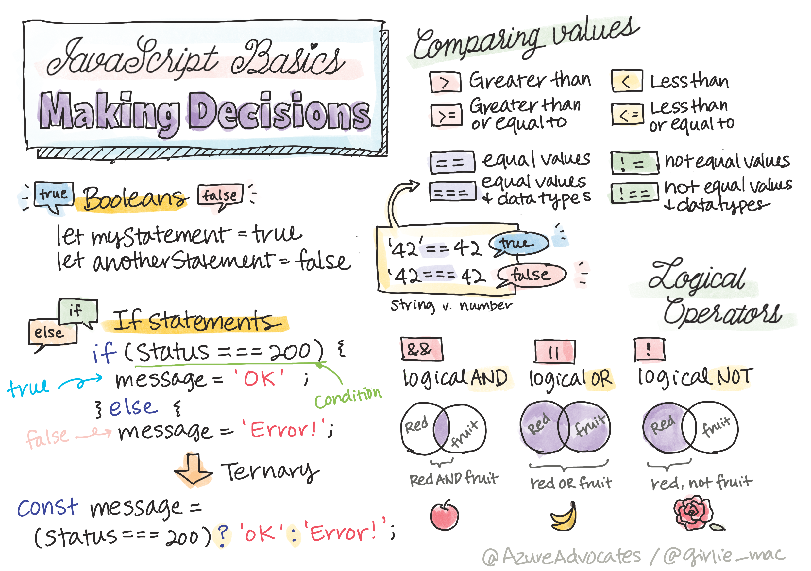

# Making Decision




## Main Point

| Concept | Time Estimate |
| --- | --- |
| Logical Operators | 
| if-else |
| ternary operation | 


## Logical Operators
- `>`
- `<`
- `>=`
- `<=`
- `===`
- `==`
- `!`
- &&
- ||


## Ternary Operation

```javascript
let variable = condition ? <return this if true> : <return this if false>
```

## Assignment


### Rule

Find Student who passed the exam
- 3 and above will pass
- C and above will pass
```
let allStudents = [
  'A',
  'B-',
  1,
  4,
  5,
  2
]

let studentsWhoPass = [];

```

To finish the assignment, student need to understant `for` concept.