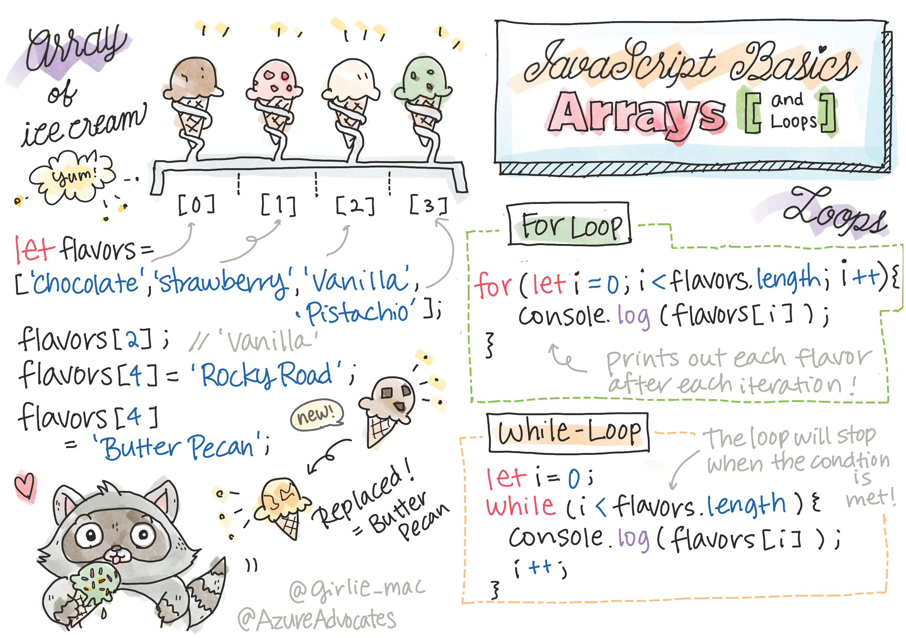

# Making Decision




## Main Point

| Concept | Time Estimate |
| --- | ---:|
| What, Why and When Array | 10 mins
| For Loop and While Loop | 15 mins
| Three components for looping | 15 mins
| Basic Array Operations | 1 hr


## Exercise Operation
[Microsoft Learn Practice Array opeartors](https://docs.microsoft.com/en-us/learn/modules/web-development-101-arrays/5-exercise-operations)

## Array
For data and information on your websites to be interactive, you need a way to manipulate and store the data in your code. Thankfully, JavaScript has a way to store multiple items in an array. Using arrays will help save you from declaring many variables, among other benefits.

### What is array
An array is a type of data structure that contains more than one element

### Manipulating array
An array's contents are commonly referred to as either elements or items. You often need to access a specific element to read its value, update it, or even remove it. 

A position in an array is referred to as its index. 

```js
Array[index] = newValue; //Changes value to newValue
```

```js
Array.push(newValue); // Add New Values
```

Delete Element
```js
delete Array[index]; // Array length will not changed.
```
```js
Array.splice(index, number of elements) // Array length will be changed
```

## Loop

they loop over data.

### For Loop
Require three components to iterate
- counter
- condition
- increment expression

### While Loop
Unlike the for loop, a while loop requires a condition that will stop the loop only when the expression in the while loop evaluates to true.

Like For loop, to create while loop, the three components must exist, but in different way.

## Basic Array Operations

- forEach
- find
- filter
- map
- some
- reduce

### forEach
There are many ways to loop through the array. ForEach is one of them.
```js
let numbers = [1, 2, 3, 4, 5];
numbers.forEach(number => console.log(number)); // 1 2 3 4 5
```

the difference between them is that the for loop lets you exit if a certain condition is fulfilled.

```You cannot use break inside forEach```