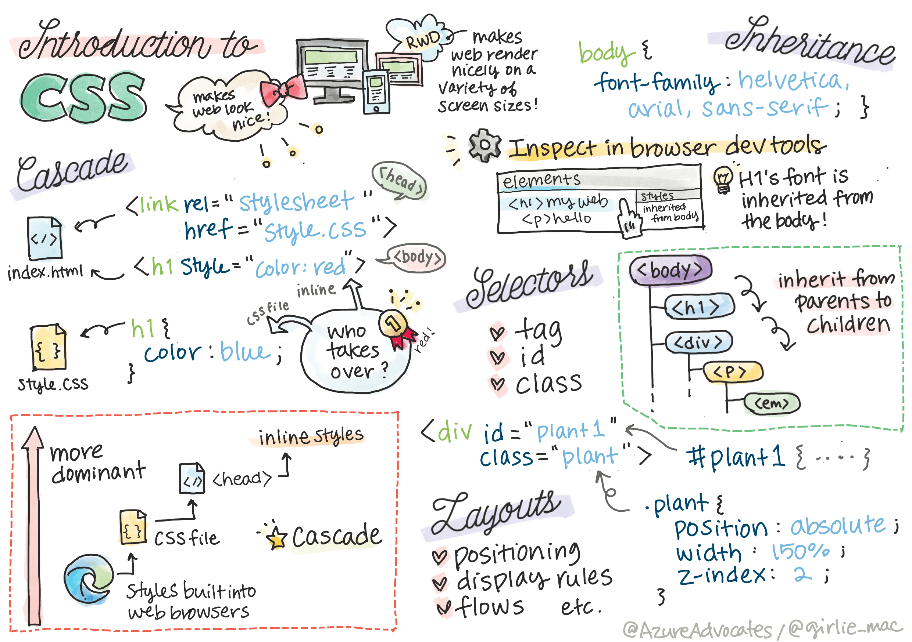

# CSS

## Main Point

| Concept | Time Estimate |
| --- | ---:|
| Cascade meaning |
| Inheritance, order |
| Devtools |
| Selector |
| attribute : value |
| inline, script |
| display, position, size, color |
