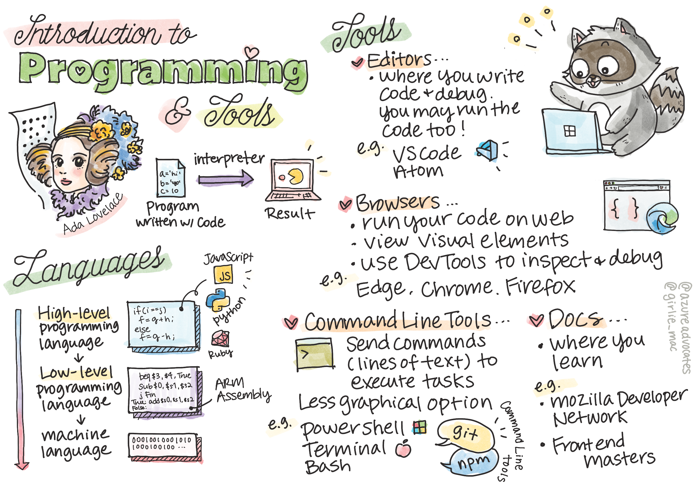

# 1. Introduction to Programming and Tools of the Trade

## Main Point

| Concept | Time Estimate |
| --- | ---:|
| def programming |
| def programmingLanguage |
| Low level and High Level Languages | Statement | 
| Data Driven and Variables |
| Flow Control |
| Tools and Editors |
| Browser and Developer Tools |
| Command Line Tool |
| Developers Documentation |

## Programming

- Programming (also known as coding) is the process of writing instructions to a device, such as a computer or mobile device.

- We write these instructions by using a programming language, which is then interpreted by the device. These sets of instructions may be referred to by various names. A few popular names are program, computer program, application (app), and executable.

## Hyperlinks

- [Microsoft learn](https://docs.microsoft.com/en-us/learn/modules/web-development-101-introduction-programming/)
- [Mozilla Developer Network](https://developer.mozilla.org/en-US/)
- [FrontEnd Master](https://frontendmasters.com/)