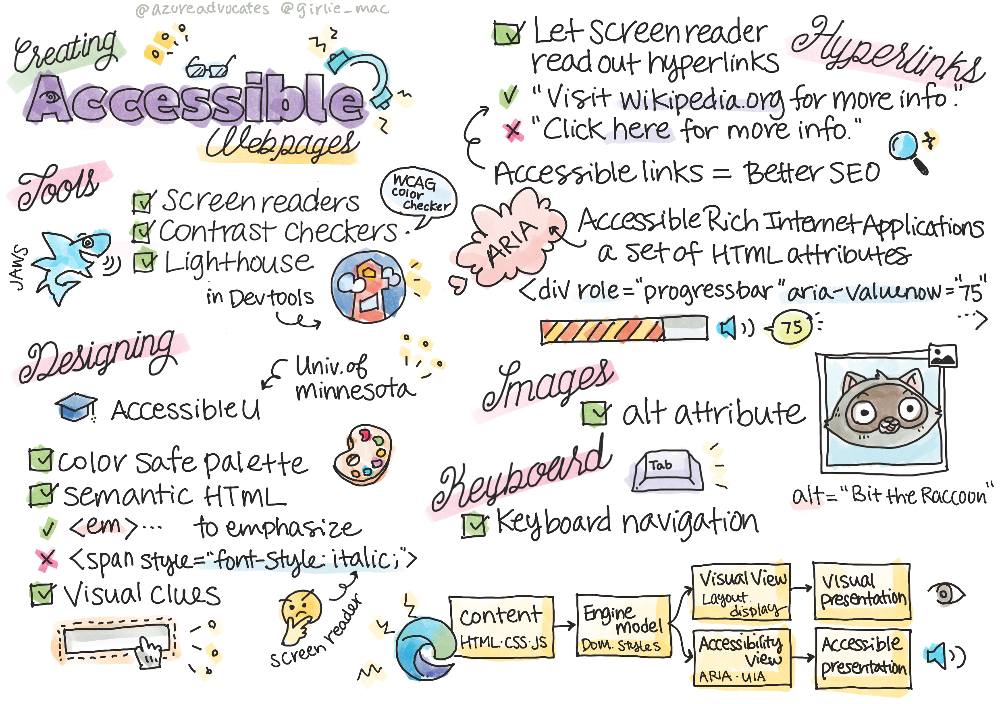

# 3. Accessibility Fundamentals

## Main Point

| Concept | Time Estimate |
| --- | ---:|
| Importance of Accessibility |
| Screen Reader |
| Contract checkers |
| Light House |
| SEO |
| Hyper links |
| Accessible Rich Internet Applications (ARIA) |
| alt tag in `` |
| semantic tag |

## Hyper Links

- [contract checkers](https://www.w3.org/TR/UNDERSTANDING-WCAG20/visual-audio-contrast-contrast.html)