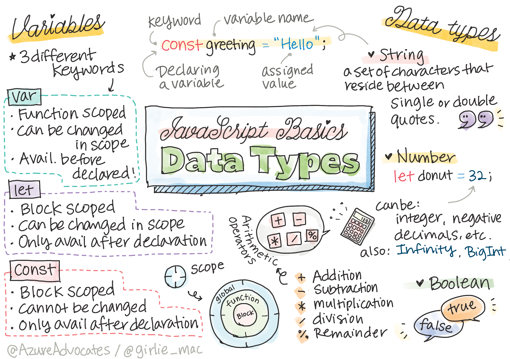

# 4. JavaScript DataType



## Main Point

| Concept | Time Estimate |
| --- | --- |
| What variable are and why to use them | 5 mins |
| What are `const`, `let` and `var` | 5 mins |
| Naming Convention | 5 mins |
| Reference of variable | 5 mins |
| How and why to store data with datatype | 5 mins |
| Numerical Operation | 5 mins |
| String formatting | 5 mins |
| Differences between =, ==, === | 5 mins|


## Notes

Steps for putting values to variable:
- Declare a variable
- Assign a value to the variable


### Variables
- Variables are named references that help you keep track of important values in your program.

- To track state. (eg. username, result of calculation)

- Data types enhance your use of variables by allowing you to specify the shape and size of the data that you need to store.

```
var userName;
```

### Let (recommanded)
```
let userName;
```

- Introduced in ECMAScript6 (ES6)
- Block Scope `!important`


### Constant

Values that don't change its values at all.
- pi
- Birthday

```
const obj = { a: 3 };
obj = { b: 5 } // not allowed
```
(Reference changed)


```
const obj = { a: 3 };
obj.a = 5;  // allowed
```
(Reference not changed)

```!Important```
```
The presence of const means the reference is protected from reassignment. But the value is not immutable and can change, especially if it's a complex construct like an object.
```

### Data Types

Data types are also called JavaScript data primitives, because they're the lowest-level data types that the language provides. There are six primitive data types: 
- string (Concat)
- number (Add, Sub, Div, Mul, Remainder)
> ```Template literals are another way to format strings```
- bigint
- boolean
> ```In JavaScript, all values are truthy unless they're defined as "falsy"```
- undefined
- symbol. (ES5)


## Assignment

Imagine you are building a shopping cart. Write some documentation on the data types that you would need to complete your shopping experience. How did you arrive at your choices?

| variable | datatype |
| --- | --- |
| let totalNumberItems | Bitint |
| let itemName | String |
| let itemId | Number |
| let itemPrice | Number |
| let isStock | Boolean |
| let comments | Undefined |
| const attributes | Symbol |
